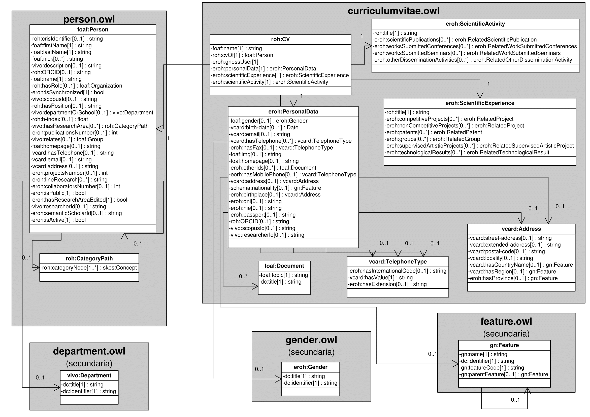
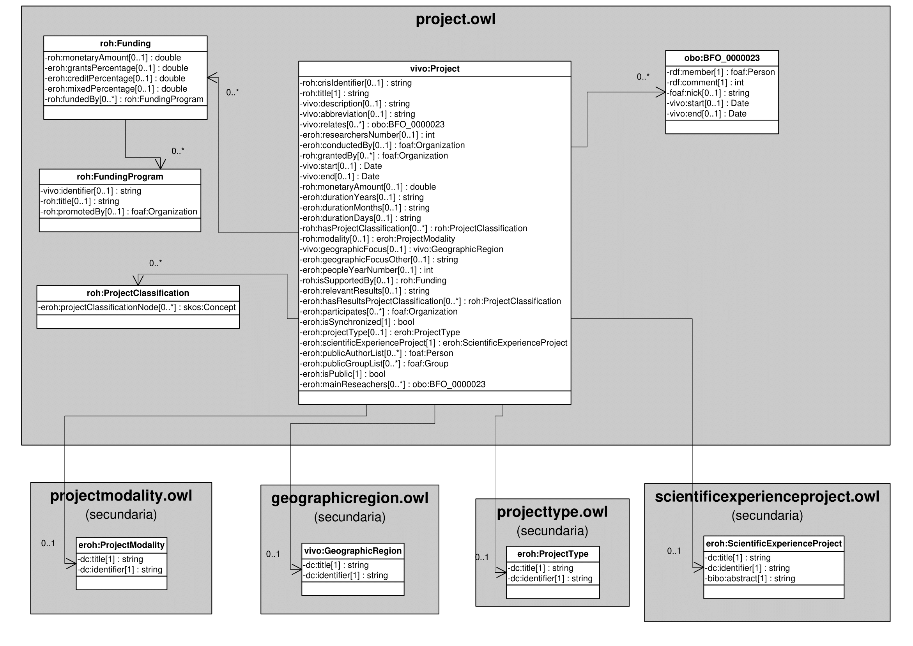
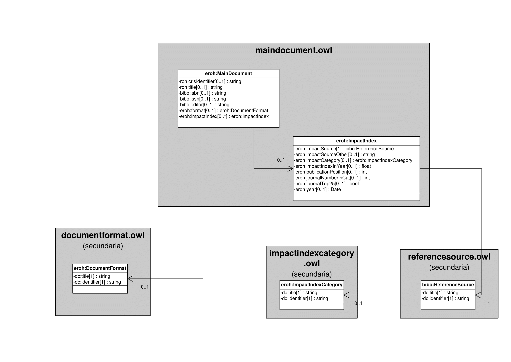
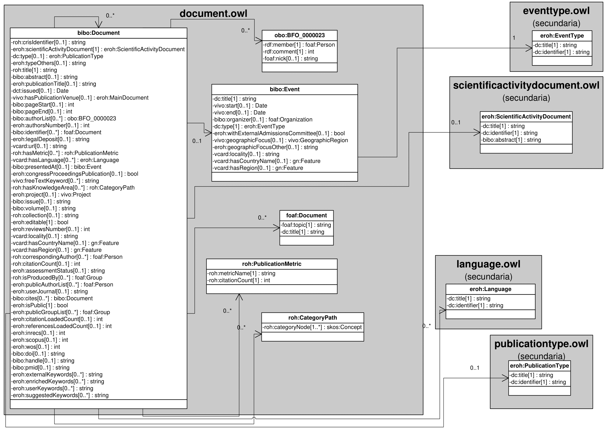
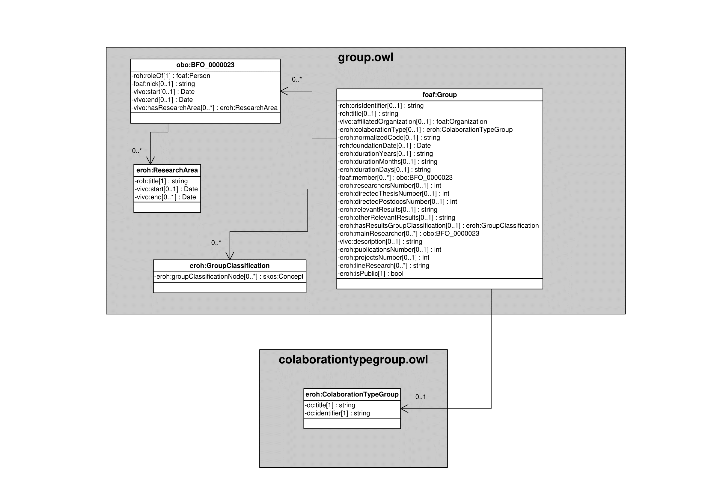

| Fecha         | 02/12/2021                                                   |
| ------------- | ------------------------------------------------------------ |
|Título|Objetos de Conocimiento| 
|Descripción|Relación de objetos de conocimiento empleados en el modelo semántico de Hércules ED|
|Versión|1.0|
|Módulo|Documentación|
|Tipo|Especificación|
|Cambios de la Versión||

# Hércules ED. Objetos de conocimiento

[Introducción](#introducción)

[Objetos de conocimiento](#objetos-de-conocimiento)

> [Persona](#persona)
>
> [Curriculum Vitae](#curriculum-vitae)
>
> [Proyecto](#proyecto)
>
> [Publicación](#publicacion)
>
> [Grupo](#grupo)

Introducción
============

El desarrollo de la Red de Ontologías Hércules (ROH) en el proyecto Hércules EDMA debe contemplar la inclusión de todos aquellos objetos de conocimiento que responden a las necesidades de correspondencia con el Curriculum Vitae Normalizado (CVN), así como de integración con el desarrollo y la gestión de datos en las diferentes interfaces de la plataforma Hércules EDMA.

El presente documento describe todos aquellos objetos de conocimiento que aplicaremos en el desarrollo y posterior uso de la infraestructura ontológica, es decir, en la Red de Ontologías Hércules y en su documentación.

Objetos de conocimiento
=======================

Persona
-------

La entidad foaf:Persona (ver Figura 1) representa a todas aquellas personas, externas o afiliadas a la Universidad de Murcia, que tienen cabida en la plataforma Hércules. La especialización de dicha entidad incorpora algunas propiedades de los dominios de investigación, además de las correspondientes a la ontología fundamental empleada en ASIO.
Por otra parte, se han añadido ciertas propiedades que extienden la ontología fundamental con el fin de dar respuesta a las necesidades de gestión de datos requeridas durante el desarrollo de la infraestructura Hércules EDMA.

En ROH, foaf:Person está basada en FOAF (Friend of a Friend) y sigue los patrones empleados en VIVO. Ello explica la inclusión de ciertas propiedades FOAF básicas como foaf:firstName, foaf:lastName, foaf:nick, foaf:name y foaf:homepage. Se han adoptado otras relaciones de importancia acordes al formato común de información en materia de la investigación europea (CERIF), como roh:hasRole, roh:h-index o roh:ORCID.

Una instancia de foaf:Person se asocia con las siguientes entidades a través de propiedades de objeto:
- foaf:Organization, que vincula a un investigador con una determinada organización.
- vivo:Department, que vincula a un investigador con un departamento o escuela universitaria concreta.
- roh:CategoryPath, que vincula las áreas temáticas en las que un investigador desarrolla su trabajo.
- foaf:Group, que vincula al investigador con uno o varios grupos de investigación.

*Figura 1*

Curriculum Vitae
----------------

Proyecto
--------

Publicación
-----------

Grupo
-----

