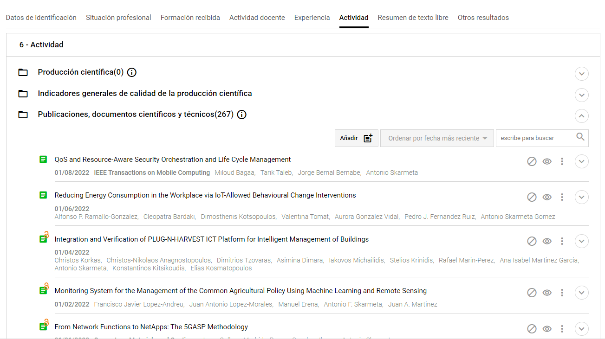
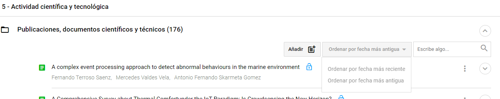
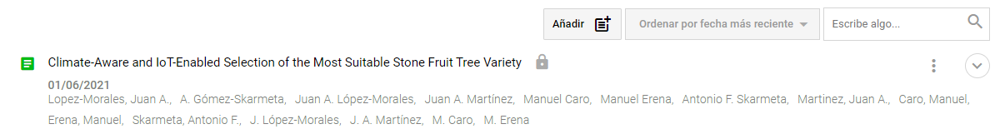
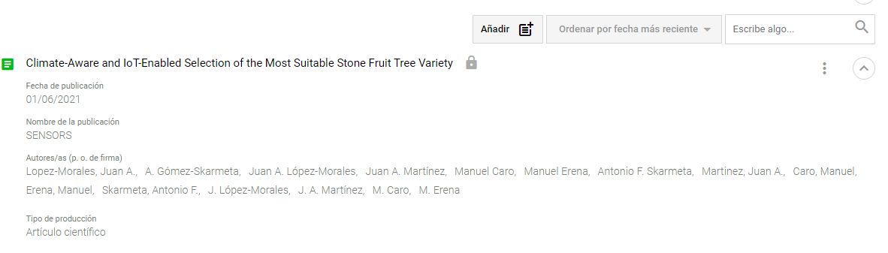
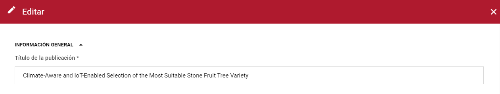

| Fecha         | 10/12/2021                                                   |
| ------------- | ------------------------------------------------------------ |
|Título|Configuración del Editor de CV| 
|Descripción|Descripción de la configuración del editor de CV en Hércules|
|Versión|1.0|
|Módulo|Documentación|
|Tipo|Especificación|
|Cambios de la Versión|Versión inicial|

# Hércules ED. Configuración del Editor de CV

[Introducción](#introducción)

[Ejemplo de edición](#ejemplo-de-edición)

* [Configuración de la presentación](#configuración-de-la-presentación)

* [Configuración de la edición](#configuración-de-la-edición)

Introducción
============

Este documento describe, mediante un ejemplo práctico, cómo se realiza la configuración de los distintos ítems de la norma CVN para su posterior incorporación y edición en el currículum vitae del investigador en Hércules ED.

La configuración de las pestañas que figuran en el CV del investigador se lleva a cabo, fundamentalmente, mediante la edición de archivos JSON situados en la carpeta ./Config/TabTemplates/ que definen diversos aspectos para cada uno de los ítems contenidos en las secciones o pestañas que define la norma CVN.

Ejemplo de edición
==================

Véase el caso en el que se desee realizar la configuración para el ítem "Publicaciones, documentos científicos y técnicos", de la pestaña "Actividad científica" en el editor del CV del investigador:




El archivo a editar para la configuración de los ítems de "Actividad científica" es ScientificActivity.json, y lo encontramos en la carpeta TabTemplates. En él veremos la siguiente estructura:

```
{
	"rdftype": "http://w3id.org/roh/ScientificActivity",
	"property": "http://w3id.org/roh/scientificActivity",
	"sections": [
		{
			"rdftype": "http://w3id.org/roh/RelatedScientificPublication",
			"property": "http://w3id.org/roh/scientificPublications",
			"presentation": {
				"type": "listitems",
				"title": {
					"es": "Publicaciones, documentos científicos y técnicos"
				},
```

Una vez localizada la propiedad del modelo semántico que corresponde con la actividad científica y tecnológica del investigador, vemos un listado de secciones (ítems) que podemos editar. En este caso, y como vemos en la imagen anterior, se procede a definir el RDF, la propiedad del ítem y el título ("Publicaciones, documentos científicos y técnicos") con el que figurará en el listado del editor.


## Configuración de la presentación


Para definir la presentación de cada una de las publicaciones que el titular del CV puede añadir en esta sección, se añade la propiedad que vincula el CV del investigador con el objeto que contendrá los datos generales de la publicación (vivo:relatedBy). Después definimos el grafo sobre el que vamos a trabajar (document) y la propiedad que mostrará el título de cada una de las publicaciones que añadamos, en este caso roh:title.

```
{
"listItemsPresentation": {
	"property": "http://vivoweb.org/ontology/core#relatedBy",
	"listItem": {
		"propertyTitle": {
			"property": "http://vivoweb.org/ontology/core#relatedBy",
			"graph": "document",
			"child": {
				"property": "http://w3id.org/roh/title"
			}
		},
		
```

Procedemos a configurar el orden con el que filtrar las publicaciones mediante la propiedad "orders". En el siguiente ejemplo se contempla la ordenación por fecha más reciente y por fecha más antigua de publicación:


```
"orders": [
	{
		"name": {
			"es": "Ordenar por fecha más reciente"
		},
		"properties": [
			{
				"property": "http://vivoweb.org/ontology/core#relatedBy",
				"graph": "document",
				"child": {
					"property": "http://purl.org/dc/terms/issued"
				},
				"asc": false
			},
			{
				"property": "http://vivoweb.org/ontology/core#relatedBy",
				"graph": "document",
				"child": {
					"property": "http://w3id.org/roh/title"
				},
				"asc": true
			}
		]
	},
	{
		"name": {
			"es": "Ordenar por fecha más antigua"
		},
		"properties": [
			{
				"property": "http://vivoweb.org/ontology/core#relatedBy",
				"graph": "document",
				"child": {
					"property": "http://purl.org/dc/terms/issued"
				},
				"asc": true
			},
			{
				"property": "http://vivoweb.org/ontology/core#relatedBy",
				"graph": "document",
				"child": {
					"property": "http://w3id.org/roh/title"
				},
				"asc": true
			}
		]
	}
	],
```

En la vista se muestra el siguiente resultado:




Tras ello, queremos definir las propiedades que mostrará cada publicación en el listado de minifichas, es decir, en la visualización previa a la edición. Además de la propiedad para el título de la publicación que hemos añadido anteriormente, queremos mostrar la fecha de la publicación, el nombre de la publicación principal (la revista) que sirve como soporte para el documento en cuestión, los autores y el tipo de producción de la publicación:


```
"properties": [
	{
		"name": {
			"es": "Fecha de publicación"
		},
		"showMiniBold": true,
		"type": "date",
		"child": {
			"property": "http://vivoweb.org/ontology/core#relatedBy",
			"graph": "document",
			"child": {
				"property": "http://purl.org/dc/terms/issued"
			}
		}
	},
	{
		"name": {
			"es": "Nombre de la publicación"
		},
		"child": {
			"property": "http://vivoweb.org/ontology/core#relatedBy",
			"graph": "document",
			"child": {
				"property": "http://vivoweb.org/ontology/core#hasPublicationVenue",
				"graph": "maindocument",
				"child": {
					"property": "http://w3id.org/roh/title"
				}
			}
		}
	},
	{
		"name": {
			"es": "Autores/as (p. o. de firma)"
		},
		"showMini": true,
		"childOR": [
			{
				"property": "http://vivoweb.org/ontology/core#relatedBy",
				"graph": "document",
				"order": "http://www.w3.org/1999/02/22-rdf-syntax-ns#comment",
				"child": {
					"property": "http://purl.org/ontology/bibo/authorList",
					"child": {
						"property": "http://xmlns.com/foaf/0.1/nick"
					}
				}
			},
			{
				"property": "http://vivoweb.org/ontology/core#relatedBy",
				"graph": "document",
				"order": "http://www.w3.org/1999/02/22-rdf-syntax-ns#comment",
				"child": {
					"property": "http://purl.org/ontology/bibo/authorList",
					"child": {
						"property": "http://www.w3.org/1999/02/22-rdf-syntax-ns#member",
						"graph": "person",
						"child": {
							"property": "http://xmlns.com/foaf/0.1/name"
						}
					}
				}
			}
		]
	},
	{
		"name": {
			"es": "Tipo de producción"
		},
		"child": {
			"property": "http://vivoweb.org/ontology/core#relatedBy",
			"graph": "document",
			"child": {
				"property": "http://purl.org/dc/elements/1.1/type",
				"graph": "publicationtype",
				"child": {
					"property": "http://purl.org/dc/elements/1.1/title"
				}
			}
		}
	}


```

Como vemos en el ejemplo anterior, cada propiedad que deseamos mostrar de la publicación viene definida por una jerarquía que la localiza en el grafo de la ontología. En el caso del nombre de la publicación, ésta se encuentra ubicada en el grafo "maindocument", por lo que debemos buscarla desde vivo:relatedBy --> bibo:Document --> vivo:hasPublicationVenue --> (cambiamos el grafo a "maindocument") --> roh:title. También podemos indicar si queremos que el valor de una determinada propiedad se muestre bajo el título sin necesidad de desplegar el resto de datos con "showMini" a true, o incluso en negrita con "showMiniBold" a true. La visualización de la instancia, sin desplegar y desplegada, quedaría así con el ejemplo de configuración anterior:






## Configuración de la edición

Finalmente, vamos a configurar los distintos campos que queremos que presente una publicación a la hora de su edición por el titular del CV. Para ello, y al nivel de "listItemsPresentation", añadimos la propiedad "listItemEdit" que contendrá, a su vez, las siguientes propiedades:

```

"listItemEdit": {
	"graph": "document",
	"proptitle": "http://w3id.org/roh/title",
	"propdescription": "http://purl.org/ontology/bibo/abstract",
	"rdftype": "http://purl.org/ontology/bibo/Document",
	"loadPropertyValues": [
		{
			"property": "http://w3id.org/roh/scientificActivityDocument",
			"values": [
				"http://gnoss.com/items/scientificactivitydocument_SAD1"
			]
		}
	],
	"sections": [
		{
			"title": {
				"es": "Información general"
			},
			"rows": [
				{
					"properties": [
						{
							"title": {
								"es": "Título de la publicación"
							},
							"placeholder": {
								"es": "Introduce el título de la publicación"
							},
							"property": "http://w3id.org/roh/title",
							"required": true,
							"type": "text",
							"width": 3
						}
					]
				},
```

El ejemplo anterior establece nuevamente el grafo y el RDF sobre los que vamos a trabajar, y con "loadPropertyValues" se define el tipo de documento cuyas propiedades vamos a cargar (publicaciones de carácter científico en este caso). Posteriormente, en la propiedad "sections" podemos realizar una agrupación de los distintos campos que queremos editar por secciones. El ejemplo define una sección denominada "Información general" donde encontramos distintas filas ("rows") en la que añadiremos las propiedades que deseamos editar. Cada "properties" equivale a una fila cuya anchura definiremos en "width", a saber 1 para un campo que ocupe 1/3 del ancho, 2 para dos tercios y 3 si queremos que el campo ocupe todo el ancho. Además del título y el placeholder de la propiedad en cuestión, podemos definir otras propiedades como la obligatoriedad con "required" o el tipo de dato con "type", entre otras. La edición para el campo "Título de la publicación", quedaría así en la interfaz:



