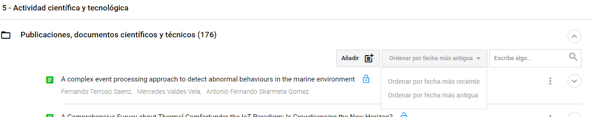
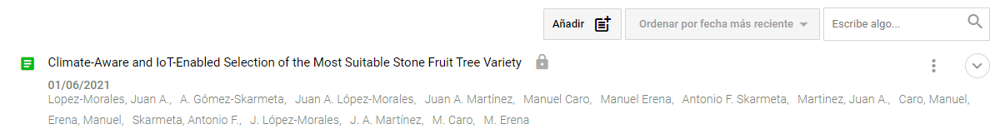
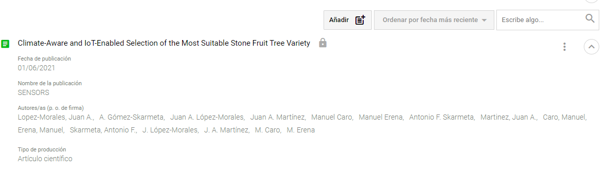
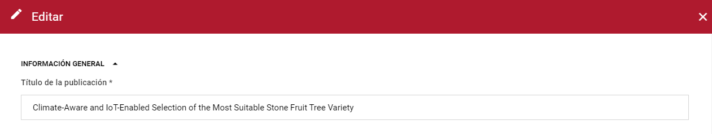
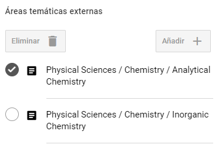
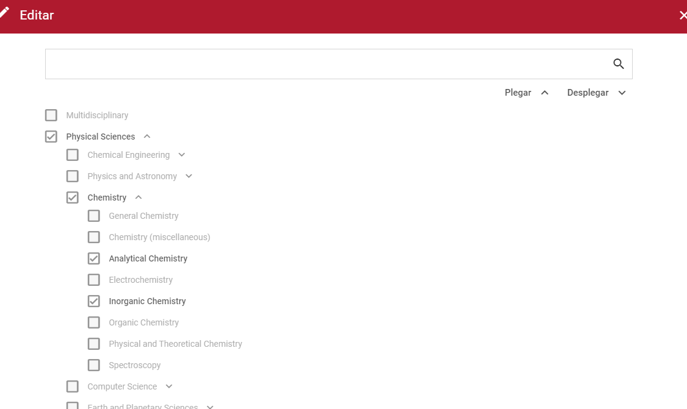
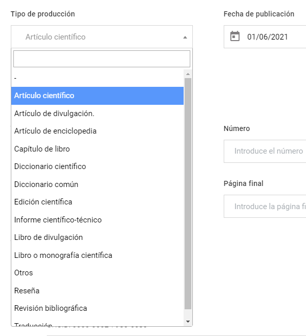
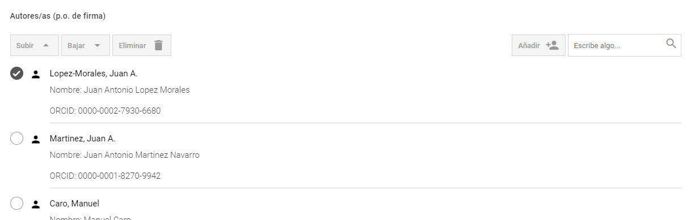
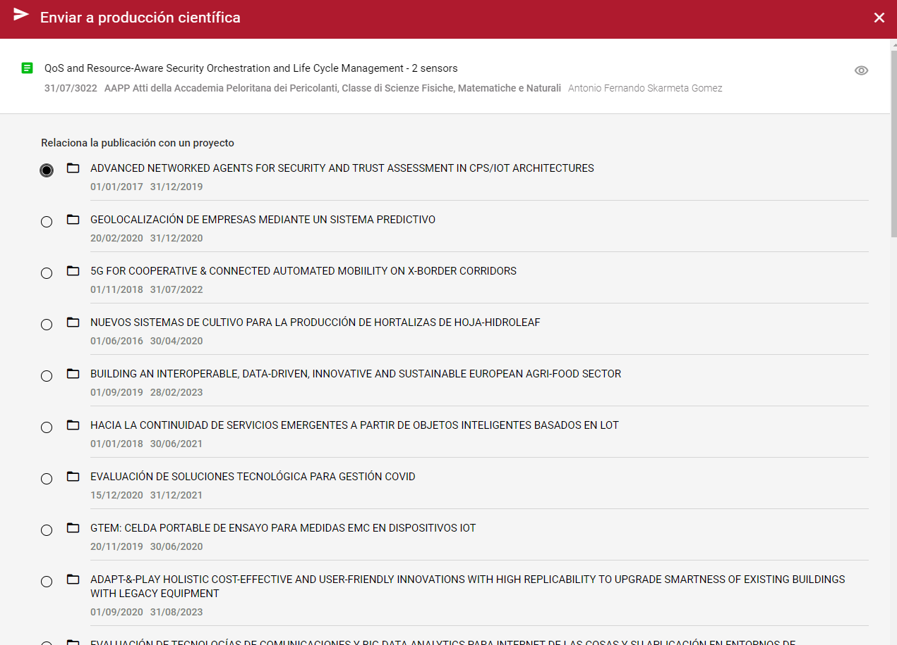
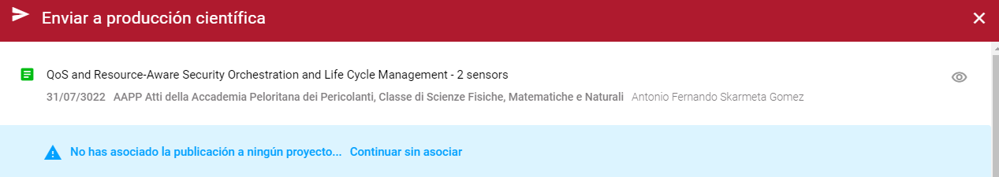

| Fecha         | 10/12/2021                                                   |
| ------------- | ------------------------------------------------------------ |
|Título|Configuración del Editor de CV| 
|Descripción|Descripción de la configuración del editor de CV en Hércules|
|Versión|1.0|
|Módulo|Documentación|
|Tipo|Especificación|
|Cambios de la Versión|Versión inicial|

# Apartados

  - [Controladores](#controladores)
  - [Hércules ED. Configuración del Editor de CV](#hércules-ed-configuración-del-editor-de-cv)
    - [Introducción](#introducción)
    - [Estructura de los JSON](#estructura-de-los-json)
    - [Métodos de edición y visualización del cv](#metodos-de-edicion-y-visualizacion-del-cv)
    - [Ejemplos de edición](#ejemplo-de-edición)
      - [Configuración de la presentación (listado y minificha)](#configuración-de-la-presentación-listado)
      - [Configuración de la edición](#configuración-de-la-edición)
  - [Ejemplo de envío a validación](#envío-a-validación-de-la-producción-científica-prc) 
  - [Ejemplo de envío a borrado](#petición-de-borrado-en-la-producción-científica-prc)
  - [Dependencias](#dependencias)

## Controladores
El servicio de editor de CV cuenta con varios controladores:

- EdicionCVController - Controlador encargado de las tareas de edición y presentación del CV correspondientes a la obtención de datos.
- GuardadoCVController - Controlador encargado de la creación, modificación y eliminacion items.
- EnvioValidacionController - Controlador encargado del envío de datos a producción cientifica (PRC) y a validación. También es el encargado de obtener todos los proyectos de una persona pasada como parametro, junto a su titulo, fecha de inicio, fecha de fin y organización.
- ExportadoCVController - Controlador encargado de la carga de datos y presentación de los mismos para la exportación de CV, además de la creación, modificación y eliminacion de perfiles de exportación.
- ImportadoCVController - Controlador encargado de la carga de datos y presentación de los mismos para la importación de CV.


## Hércules ED. Configuración del Editor de CV

### Introducción

Este servicio es utilizado para la edición de los CVs de los investigadores y para la presentación de los datos de los CVs tanto en la edición del propio CV como en la visualización de la pestaña 'otros méritos' dentro de la ficha de un investigador, para lo cual debe estar configurada la propiedad 'isPublishable':true dentro de 'listItemsPresentation' en la sección correspondiente.

Este editor se basa en el editor de CV del [fecyt](https://cvn.fecyt.es/editor/cvn.html?locale=spa#IDENTIFICACION).

Todos los items del CV son editables a excepción de:
  - Items bloqueados: Aquellos items que vengan de fuentes externas y de la sincronización con el SGI. En estos items se podrán editar las propiedades propias del usuario o las propiedades multiidioma que sólo afectan al usuario que está editando el CV.
  - Campos bloqueados: Determinados campos como el índice de impacto que se calculará automáticamente en función de la revista, año de publicación y categorías de la publicación.

Este documento describe, cómo se realiza la configuración de los distintos ítems de la norma CVN para su posterior incorporación y edición en el currículum vitae del investigador en Hércules ED.

La configuración de las pestañas que figuran en el CV del investigador se lleva a cabo mediante la edición de archivos JSON situados en la carpeta [./Config/TabTemplates/](https://github.com/HerculesCRUE/HerculesED/tree/main/src/Hercules.ED.EditorCV/EditorCV/Config/TabTemplates) que definen diversos aspectos para cada uno de los ítems contenidos en las secciones o pestañas que define la norma CVN.

### Estructura de los JSON

Cada unos de estos JSON se corresponde con un objeto [Tab](https://github.com/HerculesCRUE/HerculesED/blob/main/src/Hercules.ED.EditorCV/EditorCV/Models/API/Templates/Tab.cs).  

### Métodos de edición y visualización del cv

Para la edición y visualización del CV se utilizan los controladores 'EdicionCVController' y 'GuardadoCVController' con los métodos descritos a continuación:

  - EdicionCVController.GetTab: Sirve para obtener los datos de una pestaña del CV en la edición o para obtener los datos de una determinada sección tanto en la edición del CV como en la visualización de otros méritos en el perfil de un investigador.
  - EdicionCVController.GetAllPublicData: Sirve para la obtención de los datos generales dentro de la pestaña de otros méritos en el perfil de un investigador.
  - EdicionCVController.GetItemMini: Sirve para la obtención de los datos de un item de un listado dentro de una sección.
  - EdicionCVController.GetEdit: Sirve para obtener los datos de edición de un item dentro de la ediciónd del CV.
  - GuardadoCVController.ChangePrivacityItem: Sirve para cambiar la privacidad de un item del CV.
  - GuardadoCVController.RemoveItem: Sirve para eliminar un item del CV.
  - GuardadoCVController.UpdateEntity: Sirve para la actualización de un item del CV.
  - GuardadoCVController.ValidateORCID: Sirve para validar los datos cuando se introduce el ORCID de un investigador dentro de los autores de una publicación.
  - GuardadoCVController.CreatePerson: Sirve para crear una persona cuando se introducen los datos a mano de un investigador dentro de los autores de una publicación. 

### Ejemplos de edición

Véase el caso en el que se desee realizar la configuración para el ítem "Publicaciones, documentos científicos y técnicos", de la pestaña "Actividad" en el editor del CV del investigador:


El archivo a editar para la configuración de los ítems de "Actividad científica" es ScientificActivity.json, y lo encontramos en la carpeta TabTemplates. En él vemos la siguiente estructura:

```
{
	"rdftype": "http://w3id.org/roh/ScientificActivity",
	"property": "http://w3id.org/roh/scientificActivity",
	"sections": [
		{
			"rdftype": "http://w3id.org/roh/RelatedScientificPublication",
			"property": "http://w3id.org/roh/scientificPublications",
			"presentation": {
				"type": "listitems",
				"title": {
					"es": "Publicaciones, documentos científicos y técnicos"
				},
```

En primer lugar, se presenta el RDF y la propiedad que, en este caso, corresponden a la pestaña de actividad científica y tecnológica del investigador (roh:ScientificActivity). En un segundo nivel se sitúa el listado de secciones (ítems) que podemos editar. Como se observa en la imagen anterior, la primera sección corresponde a las publicaciones científicas (roh:scientificPublications), cuyo RDF, propiedad y presentación han sido establecidos. "presentation" contiene un tercer nivel en el que se ha definido el tipo (listado de ítems) y el título de la sección (Publicaciones, documentos científicos y técnicos).


#### Configuración de la presentación (listado y minificha)


Para definir la presentación de cada una de las publicaciones que el titular del CV puede añadir en esta sección, se añade la propiedad que vincula el CV del investigador con el objeto que contendrá los datos generales de la publicación (vivo:relatedBy). Después definimos el grafo sobre el que vamos a trabajar (document) y la propiedad que mostrará el título de cada una de las publicaciones que añadamos, en este caso roh:title.

```
{
"listItemsPresentation": {
	"property": "http://vivoweb.org/ontology/core#relatedBy",
	"listItem": {
		"propertyTitle": {
			"property": "http://vivoweb.org/ontology/core#relatedBy",
			"graph": "document",
			"child": {
				"property": "http://w3id.org/roh/title"
			}
		},
		
```

Procedemos a configurar el orden con el que filtrar las publicaciones mediante la propiedad "orders". En el siguiente ejemplo se contempla la ordenación por fecha más reciente y por fecha más antigua de publicación:


```
"orders": [
	{
		"name": {
			"es": "Ordenar por fecha más reciente"
		},
		"properties": [
			{
				"property": "http://vivoweb.org/ontology/core#relatedBy",
				"graph": "document",
				"child": {
					"property": "http://purl.org/dc/terms/issued"
				},
				"asc": false
			},
			{
				"property": "http://vivoweb.org/ontology/core#relatedBy",
				"graph": "document",
				"child": {
					"property": "http://w3id.org/roh/title"
				},
				"asc": true
			}
		]
	},
	{
		"name": {
			"es": "Ordenar por fecha más antigua"
		},
		"properties": [
			{
				"property": "http://vivoweb.org/ontology/core#relatedBy",
				"graph": "document",
				"child": {
					"property": "http://purl.org/dc/terms/issued"
				},
				"asc": true
			},
			{
				"property": "http://vivoweb.org/ontology/core#relatedBy",
				"graph": "document",
				"child": {
					"property": "http://w3id.org/roh/title"
				},
				"asc": true
			}
		]
	}
	],
```

En la vista se muestra el siguiente resultado:




Tras ello, queremos definir las propiedades que mostrará cada publicación en el listado de minifichas, es decir, en la visualización previa a la edición. Además de la propiedad para el título de la publicación que hemos añadido anteriormente, queremos mostrar la fecha de la publicación, el nombre de la publicación principal (la revista) que sirve como soporte para el documento en cuestión, los autores y el tipo de producción de la publicación:


```
"properties": [
	{
		"name": {
			"es": "Fecha de publicación"
		},
		"showMiniBold": true,
		"type": "date",
		"child": {
			"property": "http://vivoweb.org/ontology/core#relatedBy",
			"graph": "document",
			"child": {
				"property": "http://purl.org/dc/terms/issued"
			}
		}
	},
	{
		"name": {
			"es": "Nombre de la publicación"
		},
		"child": {
			"property": "http://vivoweb.org/ontology/core#relatedBy",
			"graph": "document",
			"child": {
				"property": "http://vivoweb.org/ontology/core#hasPublicationVenue",
				"graph": "maindocument",
				"child": {
					"property": "http://w3id.org/roh/title"
				}
			}
		}
	},
	{
		"name": {
			"es": "Autores/as (p. o. de firma)"
		},
		"showMini": true,
		"childOR": [
			{
				"property": "http://vivoweb.org/ontology/core#relatedBy",
				"graph": "document",
				"order": "http://www.w3.org/1999/02/22-rdf-syntax-ns#comment",
				"child": {
					"property": "http://purl.org/ontology/bibo/authorList",
					"child": {
						"property": "http://xmlns.com/foaf/0.1/nick"
					}
				}
			},
			{
				"property": "http://vivoweb.org/ontology/core#relatedBy",
				"graph": "document",
				"order": "http://www.w3.org/1999/02/22-rdf-syntax-ns#comment",
				"child": {
					"property": "http://purl.org/ontology/bibo/authorList",
					"child": {
						"property": "http://www.w3.org/1999/02/22-rdf-syntax-ns#member",
						"graph": "person",
						"child": {
							"property": "http://xmlns.com/foaf/0.1/name"
						}
					}
				}
			}
		]
	},
	{
		"name": {
			"es": "Tipo de producción"
		},
		"child": {
			"property": "http://vivoweb.org/ontology/core#relatedBy",
			"graph": "document",
			"child": {
				"property": "http://purl.org/dc/elements/1.1/type",
				"graph": "publicationtype",
				"child": {
					"property": "http://purl.org/dc/elements/1.1/title"
				}
			}
		}
	}


```

Como vemos en el ejemplo anterior, cada propiedad que deseamos mostrar de la publicación viene definida por una jerarquía que la localiza en el grafo de la ontología. En el caso del nombre de la publicación, ésta se encuentra ubicada en el grafo "maindocument", por lo que debemos buscarla desde vivo:relatedBy --> bibo:Document --> vivo:hasPublicationVenue --> (cambiamos el grafo a "maindocument") --> roh:title. También podemos indicar si queremos que el valor de una determinada propiedad se muestre bajo el título sin necesidad de desplegar el resto de datos con "showMini" a true, o incluso en negrita con "showMiniBold" a true. La visualización de la instancia, sin desplegar y desplegada, quedaría así con el ejemplo de configuración anterior:






#### Configuración de la edición

Finalmente, vamos a configurar los distintos campos que queremos que presente una publicación a la hora de su edición por el titular del CV. Para ello, y al nivel de "listItemsPresentation", añadimos la propiedad "listItemEdit" que contendrá, a su vez, las siguientes propiedades:

* "graph" --> El grafo utilizado.
* "proptitle" --> La propiedad del título.
* "propAuthor" --> Establece la propiedad en la que el propietario debe figurar como autor de forma obligatoria en caso de que sea necesario (publicaciones)
* "propdescription" --> La propiedad de la descripción.
* "rdftype" --> El RDF.
* "loadPropertyValues" --> Establece el valor que toma la propiedad que distingue el tipo de publicación (según CVN) con el que vamos a trabajar.
* "sections" --> Aquí se define el listado de campos que se desea incluir en la edición de este ítem.

```

"listItemEdit": {
	"graph": "document",
	"proptitle": "http://w3id.org/roh/title",
	"propdescription": "http://purl.org/ontology/bibo/abstract",
	"rdftype": "http://purl.org/ontology/bibo/Document",
	"loadPropertyValues": [
		{
			"property": "http://w3id.org/roh/scientificActivityDocument",
			"values": [
				"{GraphsUrl}items/scientificactivitydocument_SAD1"
			]
		}
	],
	"sections": [
		{
			"title": {
				"es": "Información general"
			},
			"rows": [
				{
					"properties": [
						{
							"title": {
								"es": "Título de la publicación"
							},
							"placeholder": {
								"es": "Introduce el título de la publicación"
							},
							"property": "http://w3id.org/roh/title",
							"required": true,
							"type": "text",
							"width": 3
						}
					]
				},
```

El ejemplo anterior establece nuevamente el grafo y el RDF sobre los que vamos a trabajar, y con "loadPropertyValues" se define el tipo de documento cuyas propiedades vamos a cargar (publicaciones de carácter científico en este caso). Posteriormente, en la propiedad "sections" podemos realizar una agrupación de los distintos campos que queremos editar por secciones. El ejemplo define una sección denominada "Información general" donde encontramos distintas filas ("rows") en la que añadiremos las propiedades que deseamos editar. Cada "properties" equivale a una fila cuya anchura definiremos en "width", a saber 1 para un campo que ocupe 1/3 del ancho, 2 para dos tercios y 3 si queremos que el campo ocupe todo el ancho. Además del título y el placeholder de la propiedad en cuestión, podemos definir otras propiedades como la obligatoriedad con "required" o el tipo de dato con "type", entre otras. La edición para el campo "Título de la publicación" quedaría así en la interfaz:





En caso de que se quiera incorporar un campo con una estructura jerarquizada de tesauro, además del empleo de propiedades mencionadas anteriormente, como "title", "property", "type" o "width", la configuración debe llevarse a cabo utilizando la propiedad "thesaurus" con valor "researcharea", además de "type" con valor "thesaurus". Además, podemos emplear la propiedad "multiple" con valor true si se requieren múltiples instancias del campo en cuestión:

```

{
	"properties": [
	{
		"title": {
			"es": "Áreas temáticas externas"
		},
		"property": "http://w3id.org/roh/externalKnowledgeArea",
		"thesaurus": "researcharea",
		"type": "thesaurus",
		"width": 0,
		"multiple": true
	}
]
},

```

La interfaz de edición del campo "Áreas temáticas externas" presentará este aspecto:






En algunas ocasiones resulta necesario editar propiedades que están fuera del grafo, como ocurre con entidades secundarias. La forma de proceder es similar a las configuraciones descritas anteriormente, pero se debe especificar el grafo al que nos estamos moviendo. En el siguiente ejemplo se define el campo que recoge el tipo de publicación a través de una selección de tipo combo:

```

{
	"title": {
		"es": "Tipo de producción"
	},
	"property": "http://purl.org/dc/elements/1.1/type",
	"combo": {
		"rdftype": "http://w3id.org/roh/PublicationType",
		"graph": "publicationtype",
		"property": {
			"property": "http://purl.org/dc/elements/1.1/title"
		}
	},
	"type": "selectCombo",
	"width": 1
},

```

Una vez establecida la propiedad de la publicación sobre la que deseamos trabajar (dc:type), debemos localizar la entidad a la que esta apunta mediante la especificación, en un segundo nivel, del RDF, el grafo y la propiedad de la que vamos a extraer los valores del combo (dc:title). Será preciso además establecer como valor de "type" la cadena "selectCombo", de modo que el desplegable que contiene las distintas opciones del combo se visualice correctamente en la interfaz:



Para establecer el campo de la autoría se ha realizado una configuración a medida que permite hacer una búsqueda de los diferentes autores por su firma y comprobar el grado de coincidencia que dichas firman revelan según las personas almacenadas en el sistema. Este caso es resuelto estableciendo el valor de "type" como "auxEntityAuthorList":

```

{
	"properties": [
		{
			"property": "http://purl.org/ontology/bibo/authorList",
			"type": "auxEntityAuthorList",
			"title": {
				"es": "Autores/as (p.o. de firma)"
			},
			"width": 3
		}
	]
}

```

Quedando la visualización en la interfaz del siguiente modo:



## Envío a validación de la producción científica (PRC)
El editor de CV permite envíar a validar publicaciones (obtenidas por el CV y por fuentes externas) al SGI. Una vez validada dicha publicación, es apta y oficial para la plataforma. Para proceder al envío, hay que ir a una publicación y pulsar sobre "Enviar a validación" situado en el menú de acciones (tres puntos):


Al pulsar, se despliegará una ventana para poder enlazar la publicación a proyectos.



En esta ventana puedes relacionar la publicación con uno o más proyectos. En el caso de que no se quiera relacionar con ningún proyecto, aparecerá una alerta indicando que no se ha asociado con ningún proyecto junto a un botón para continuar sin asociar.



Al desplazarse hacia abajo en la ventana, se encontrará un botón de enviar con el que la publicación se enviará a validar, junto con los proyectos asociados y el envío pasará al estado "Pendiente de validación" con el siguiente icono:


Una vez que esté validada, la publicación se podrá editar parcialmente y se mostrará de la siguiente manera:


En el caso que la publicación haya sido rechazada del envío, no se mostrará el icono de validado y se podrá volver a envíar a PRC para solicitar la validación.

## Petición de borrado en la producción científica (PRC)
Para el envío de borrado de producción científica se mandará una petición a validación, como si se tratase del envío a PRC normal, con la diferencia que el título de la publicación tendrá "[Petición de borrado]" y el identificador interno de la publicación estará compuesto por "Eliminar_ID". El usuario encargado de la modificación en el SGI, tendrá que validar la petición de borrado y borrar de sus sitemas la publicación. En el caso de querer borrar una publicación validada, se podrá hacer si pulsamos en "Enviar a borrar a producción científica".


Mientras esté en pendiente de borrado, volverá a aparecer el siguiente icono:


Finalmente, cuando se haya borrado, la publicación desaparecerá del SGI y del CV. En el caso de haber sido rechazada, no desaparecerá de los sistemas, y como en el envío a PRC, se podrá volver a solicitar el borrado.

## Dependencias
- **GnossApiWrapper.NetCore**: v6.0.6
- **Microsoft.AspNet.WebApi.Client**: v5.2.7
- **Newtonsoft.Json**: v13.0.1
- **RabbitMQ.Client**: v6.2.4
- **RestSharp**: v106.15.0
- **Swashbuckle.AspNetCore**: v5.6.3
