| Fecha         | 4/3/2022                                                   |
| ------------- | ------------------------------------------------------------ |
|Título|Servicio de procesamiento de curriculums vitae (CV).| 
|Descripción|Servicio encargado de importación y exportación de curriculums vitae (CV).|
|Versión|1.0|
|Módulo|Documentación|
|Tipo|Especificación|
|Cambios de la Versión|Versión inicial|


[](https://sonarcloud.io/summary/new_code?id=Hercules.ED.ImportExportCV)

[](https://sonarcloud.io/summary/new_code?id=Hercules.ED.ImportExportCV)
[](https://sonarcloud.io/summary/new_code?id=Hercules.ED.ImportExportCV)
[](https://sonarcloud.io/summary/new_code?id=Hercules.ED.ImportExportCV)
[](https://sonarcloud.io/summary/new_code?id=Hercules.ED.ImportExportCV)


# Introducción
El servicio de procesamiento de CV, es el encargado de leer los archivos recibidos por FECYT y tratar los datos leidos, para posteriormente insertarlos en base de datos (BBDD).
Tambien es posible extraer los datos almacenados en BBDD, y recibir un CV en formato .pdf acorde a la normativa de FECYT.

El análisis funcional relacionado con el CV se puede consultar en [Edición CV - CVN](https://confluence.um.es/confluence/pages/viewpage.action?pageId=397534628).

## Servicios
- [ObtenerORCID](#obtener-orcid)
- [Preimportación](#preimportación-de-cvn)
- [Importación](#importación-de-cvn)
- [Postimportación](#postimportación-de-cvn)
- [Exportación](#exportación-de-cvn)
- [Exportación limitada](#exportación-limitada-de-cvn)

## Ejemplos
- [Ejemplo de importación](#ejemplo-de-importación)
- [Ejemplo de exportación](#ejemplo-de-exportación)

## Obtener ORCID
El servicio de obtención de ORCID recibirá un fichero en formato PDF, leerá los datos almacenados en el mismo y devolverá el ORCID.

## Preimportación de CVN
El servicio de preimportación devuelve los datos leidos de un Documento XML o PDF pasados como parametro, junto al identificador de CV de la persona, y como dato opcional las secciones que se desea leer, las cuales se deberá pasar el codigo CVN de FECYT.
Los datos leidos se devolverán como un JSON, para posteriormente elegir cual de ellos importar, junto a un documento XML obtenido del fichero inicial pasado como parametro, ademas de un fichero XML el cual contendrá los datos de un objeto Preimport.

## Importación de CVN
Dado un identificador del CV, el fichero de CV en formato PDF o XML asociado a la persona y opcionalmente las secciones que se desean incluir, las cuales se deberá pasar el codigo CVN de FECYT. 
Insertará en BBDD los datos leidos del documento, en caso de que se encuentren duplicidades, se resolverán por medio del [motor de desambiguación](https://github.com/HerculesCRUE/HerculesED/tree/main/src/Hercules.CommonsEDMA.DisambiguationEngine).

## Postimportación de CVN
Dado un identificador del CV, el fichero de CV en formato XML asociado a la persona como array de bytes, el fichero Preimport en formato XML como array de bytes, el listado de identificadores de los recusos a añadir y opcionalmente el listado de identificadores de los recursos concatenados por "|||" con las opciones seleccionadas, las cuales pueden ser:
- Duplicar - "du"
- Fusionar - "fu"
- Sobrescribir - "so"
- Ignorar - "ig"

Insertará en BBDD los datos leidos del documento que formen parte del listado de identificadores y les aplicará la opción seleccionada en cada uno de ellos, en caso de no tener ninguna se duplicará.

## Ejemplo de importación
En el caso de querer importar un CV por parte del usuario desde la pestaña de importar, adjuntaremos un archivo PDF con el CV asociado.

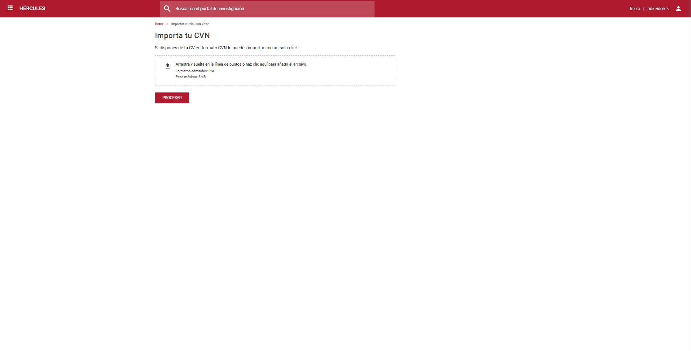

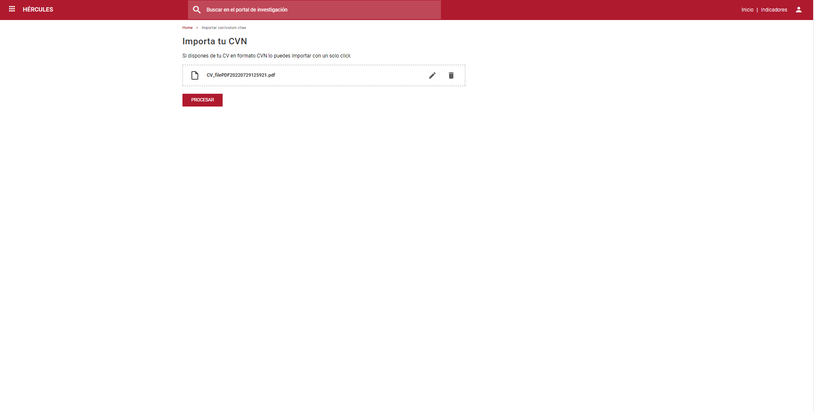

Clicaremos en el botón de "PROCESAR" para que el fichero sea leido y procesado para su carga en el sistema.

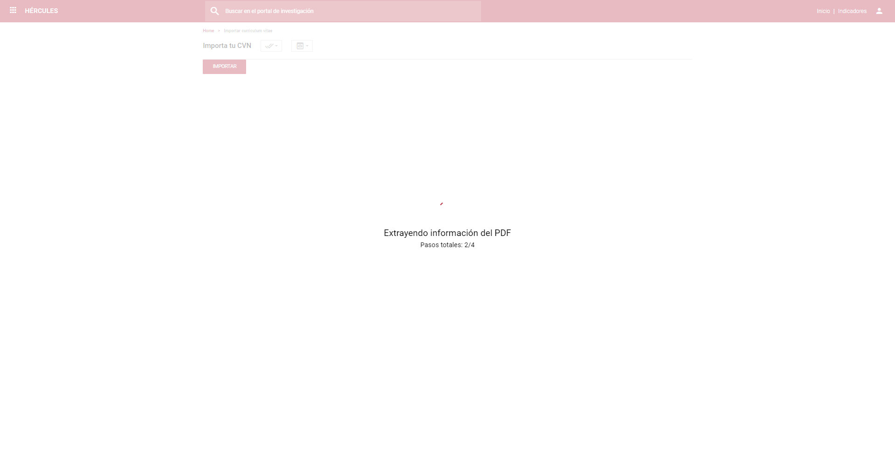

Tras el procesado del archivo necesitaremos seleccionar los ítems que el sistema haya detectado como similares sobre los que están cargados previamente en el CV del usuario, puesto que los ítems nuevos estarán preseleccionados por defecto, además de la sección de datos de identificación. 
El usuario puede no cargar elementos nuevos quitando el check que estará por defecto seleccionado. Los ítems con similitudes tendrán un dropbox con diferentes opciones a seleccionar dependiendo de si el ítem con similaridad está validado o no, en el caso de estar validado se señalizará con el siguiente icono: 


Si se desea cargar, modificar o duplicar algún ítem con similaridad se deberá hacer click para poder desbloquear el dropbox asociado al mismo.

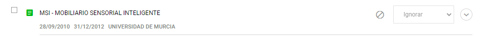
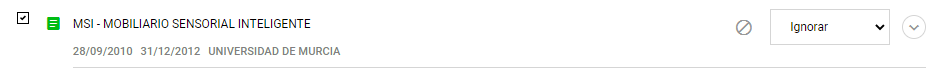

Las opciones que aparecererán en ambos casos serán:
- Ignorar - Opción por defecto, si no se cambia no se cargará el ítem.
- Fusionar - Añadirá a los valores vacios del ítem en BBDD, los valores del ítem cargado. 
- Duplicar - Añadirá un ítem nuevo.

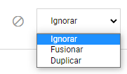

En el caso de que el ítem no esté validado además aparecerá la opción:
- Sobrescribir - El ítem cargado sobrescribirá los datos del que está actualmente en BBDD.

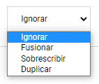

Tras seleccionar los ítems deseados por el usuario se debe hacer click en el botón "IMPORTAR" al final de la página para que el sistema empiece a cargar o modificar los datos.

## Exportación de CVN
El servicio de exportación devolverá un fichero PDF con los datos almacenados en BBDD, pertenecientes al usuario con identificador de CV, en el tipo de formato de CV, la versión de exportación y en el lenguaje indicado.

Los formatos de CV son:
- CV - Curriculum Vitae - "PN2008"
- CVA-ISCIII - Curriculum Vitae Abreviado (ISCIII) - "CVAISCIII"
- CVA-AEI - Curriculum Vitae Abreviado (AEI) - "CVA2015"

Las versiones de exportación soportadas son:
- 1.4.0 - "1_4_0"
- 1.4.3 - "1_4_3"

Los posibles lenguajes son:
- Español - "es"
- Catalan - "ca"
- Euskera - "eu"
- Gallego - "gl"
- Inglés - "en"
- Frances - "fr"

## Exportación limitada de CVN
El servicio de exportación limitada, es similar al de exportación, pero filtrando mediante un listado de identificadores los recursos que se desean recibir de BBDD.

## Ejemplo de exportación
En el caso de querer exportar un CV desde la pestaña de exportar, el usuario deberá añadir un titulo para el fichero de CV, seleccionar el idioma en el que desea que se exporte, el tipo de exportación, la versión de exportación y si desea exportar todas las secciones, seleccionar que desea exportar o tener precheckeados los ítems de los últimos 5 años.
Los idiomas de exportación son:
- Español
- Inglés
- Catalán
- Euskera
- Gallego
- Francés

El tipo de exportación:
- CVN - Tipo por defecto, Curriculum vitae normalizado
- CVA-ISCIII - Curriculum vitae abreviado (ISCIII)
- CVA-AEI - Curriculum vitae abreviado (AEI)

La versión de exportación:
- 1.4.0
- 1.4.3

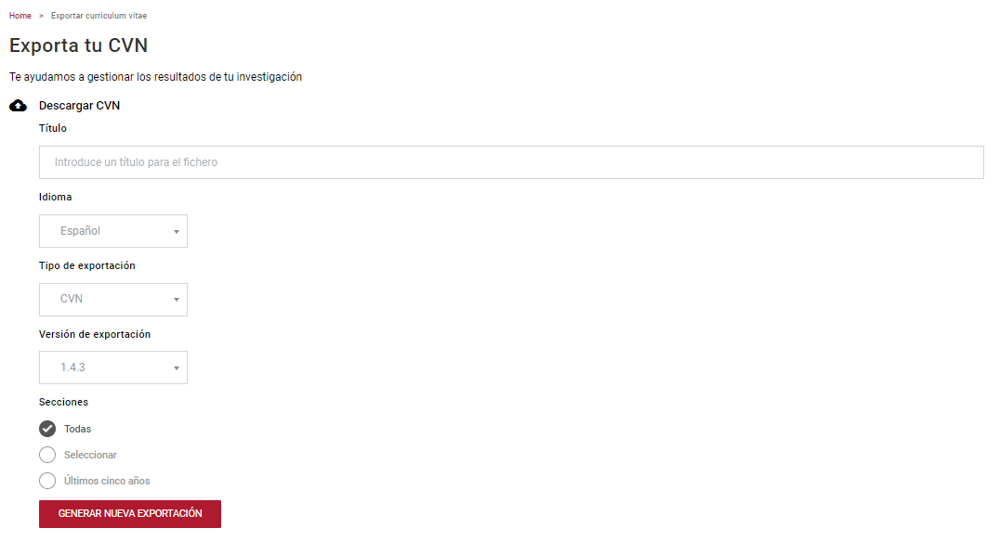

En el caso de seleccionar la opción de exportación "Seleccionar" o "Últimos cinco años", se cargarán los datos del usuario cargados en BBDD. 
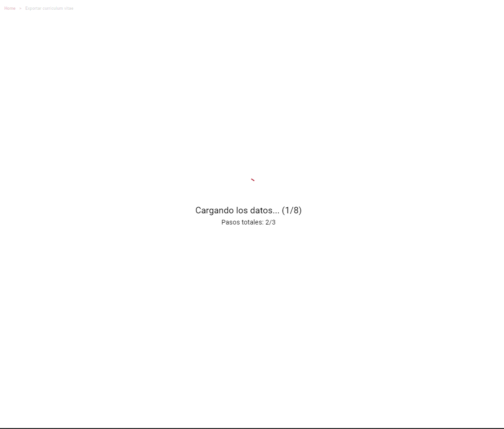

Los elementos apareceran por defecto sin seleccionar a excepción de los Datos de identificación del usuario, en el caso de que la opción sea "Últimos cinco años" los elementos de los últimos 5 años estarán preseleccionados.

Opción "Seleccionar":
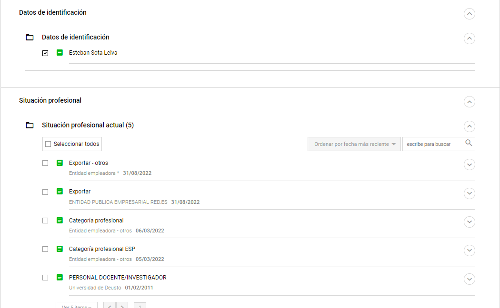

Opción "Últimos cinco años":
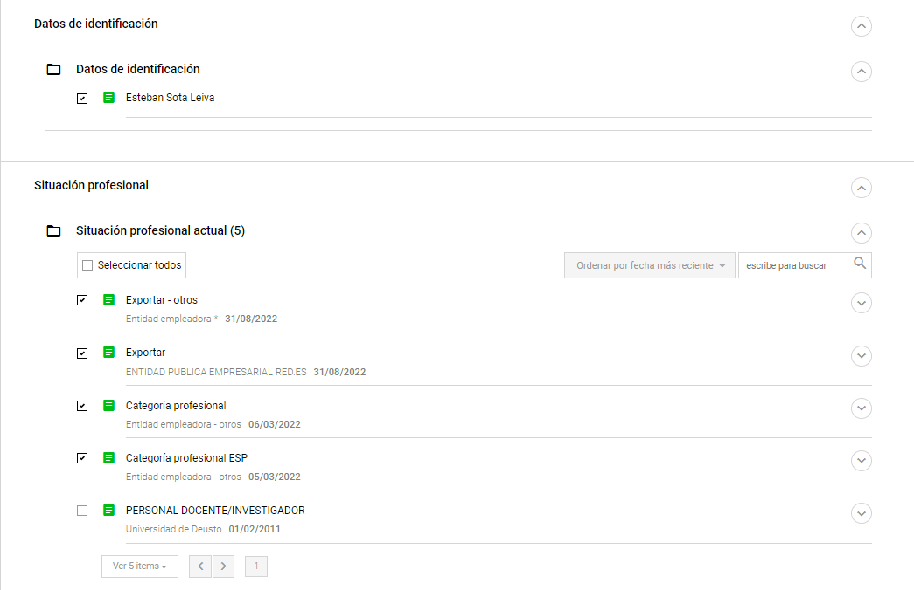

Aquí el usuario podrá guardar perfiles de exportación para guardar los elementos seleccionados para futuras exportaciones. El usuario podrá añadir nuevos perfiles, seleccionar la carga de uno guardado previamente o la eliminación de alguno de los perfiles guardados.

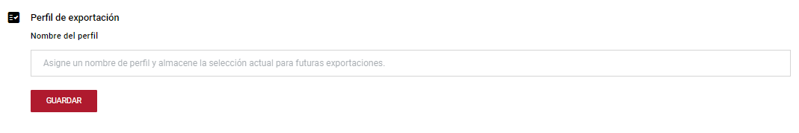
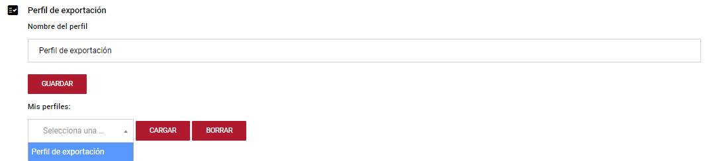

Tras seleccionar los ítems que se desean exportar, se debe seleccionar el botón "EXPORTAR", tras el cual se redirigirá al usuario a la pagina inicial con un nuevo elemento a exportar que estará en el estado "Pendiente" hasta que se haya creado el PDF, momento en el cual pasará a "Procesado" o "Error" en el caso de que se haya producido algún problema en el excepción del fichero.
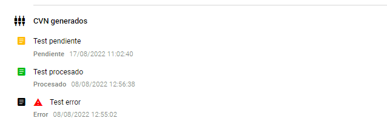


## Configuración en el appsetting.json
```json{
{
	"Logging": {
		"LogLevel": {
			"Default": "",
			"Microsoft": "",
			"Microsoft.Hosting.Lifetime": ""
		}
	},
	"AllowedHosts": "*",
	"Usuario_PDF": "",
	"PSS_PDF": "",
	"Version": "",
	"ConnectionStrings": {
		"RabbitMQ": ""
	},
	"UrlEnriquecimiento": "",
	"UrlPublicationAPI": "",
	"DenormalizerQueueRabbit": ""
}
```

- LogLevel.Default: Nivel de error por defecto.
- LogLevel.Microsoft: Nivel de error para los errores propios de Microsoft.
- LogLevel.Microsoft.Hosting.Lifetime: Nivel de error para los errores de host.
- Usuario_PDF: Usuario de autenticación para la conversión de ficheros en el endpoint de FECYT.
- PSS_PDF: Contraseña de autenticación para la conversión de ficheros en el endpoint de FECYT.
- Version: Version del documento PDF.
- ConnectionStrings.RabbitMQ: Cadena de conexión de Rabbit.
- UrlEnriquecimiento: URL dónde está instalado el servicio de enriquecimiento.
- UrlPublicationAPI: URL dónde está instalado el servicio de publicación.
- DenormalizerQueueRabbit: Nombre de la cola de Rabbit.

## Dependencias
- **GnossApiWrapper.NetCore**: v1.0.8
- **RabbitMQ.Client**: v6.3.0
- **Swashbuckle.AspNetCore**: v5.6.3
- **System.ServiceModel.Http**: v4.9.0
